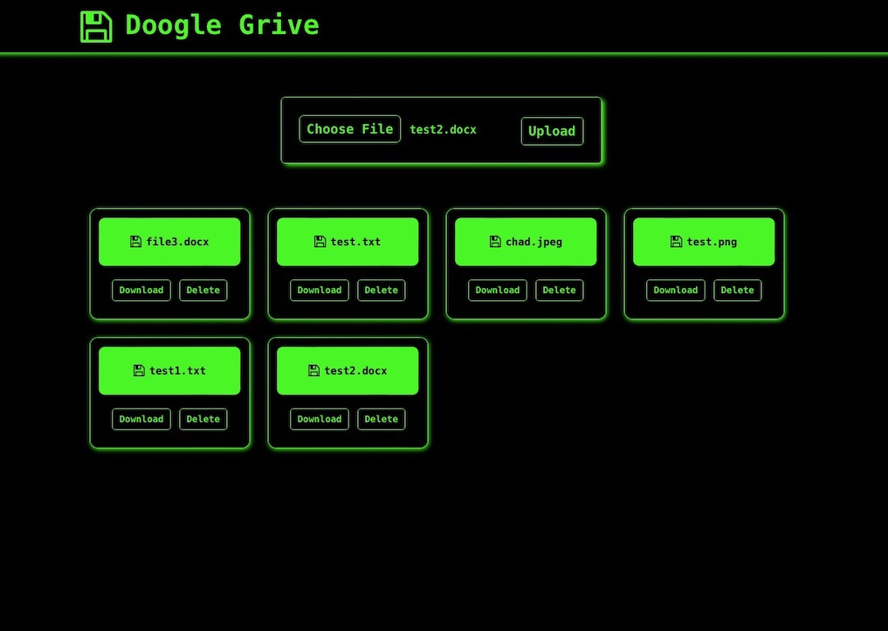

# CPSC559 Project - Distributed File System
#TODOs
~~- Let proxy know when a server is back online so it can be added back to the "active servers" list~~
- When a proxy detects a server failure, let the other servers know of this failure (each server maintain an "active server" list? All share the list maintained by the proxy?)
- Implement server crash recover to server 2&3 (fastForward() func)
- Dynamically pick an active server to replicate when recovering (server 1 just asks server 2 atm)

Distributed file system that allows users to upload, download and delete files. 
<pre>
Client --> Proxy --> Server --> 
                                Mongodb Atlas
Client <-- Proxy <-- Server <-- 
</pre> 



# Setup / Run
### Main Server + Replicas (run in separate terminals)
```bash
# get server packages
cd server
npm ci

# run main server
node server

# new terminal
cd server
# run replica server 1
node server2
```

### Proxy
```bash
# get proxy packages
cd proxy
npm ci

# run proxy
node proxy
```

### Client
```bash
# get client packages
cd client
npm ci

# run client
npm start
```

# HTTP Servers
### Main Proxy -> (http://localhost:1111)
- Randomly picks a server to forwards HTTP requests to
- Relays HTTP responses back to client
### Backup Proxy -> (http://localhost:2222)

### Main Server -> (http://localhost:3333)
- Receives HTTP requests from the proxy
- Interacts directly with MongoDB
- Replicates requests to other server(s) "gossip"

### Server Replica 1 -> (http://localhost:5555)
### Server Replica 2 -> (http://localhost:7777)

# MongoDB Endpoints
- Main MongoDB URL -> https://us-east-1.aws.data.mongodb-api.com/app/filesystem-lkvhv/endpoint
- MongoDB Replica1 URL -> https://us-east-1.aws.data.mongodb-api.com/app/filesystemrep1-uzxxi/endpoint

### GET /Files
Returns all files in the database.  
- Params: NONE  
- Body: NONE
``` bash
# main
https://us-east-1.aws.data.mongodb-api.com/app/filesystem-lkvhv/endpoint/files
# replica 1
https://us-east-1.aws.data.mongodb-api.com/app/filesystemrep1-uzxxi/endpoint/files
```
### POST /Upload
Insert a new file document into the database.  
- Params: name
- Body: { file : < fileData >}
``` bash
# main
https://us-east-1.aws.data.mongodb-api.com/app/filesystem-lkvhv/endpoint/upload
# replica 1
https://us-east-1.aws.data.mongodb-api.com/app/filesystemrep1-uzxxi/endpoint/upload
```
### GET /Download
Download an existing file from the database.  
- Params: name  
- Body: NONE
``` bash
# main
https://us-east-1.aws.data.mongodb-api.com/app/filesystem-lkvhv/endpoint/download
# replica 1
https://us-east-1.aws.data.mongodb-api.com/app/filesystemrep1-uzxxi/endpoint/download
```
### POST /Delete
Remove an existing file from the database.  
- Params: name  
- Body: NONE
``` bash
# main
https://us-east-1.aws.data.mongodb-api.com/app/filesystem-lkvhv/endpoint/delete
# replica 1
https://us-east-1.aws.data.mongodb-api.com/app/filesystemrep1-uzxxi/endpoint/delete
```

# Dependencies
- MongoDB Atlas
- React
- Node
- Express
- Axios
- DownloadJs
- Bootstrap